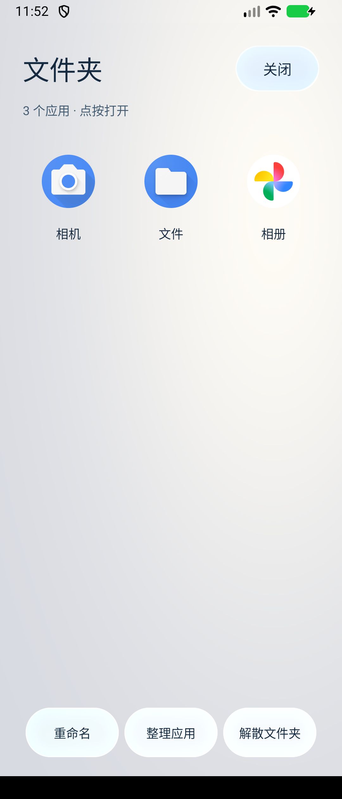
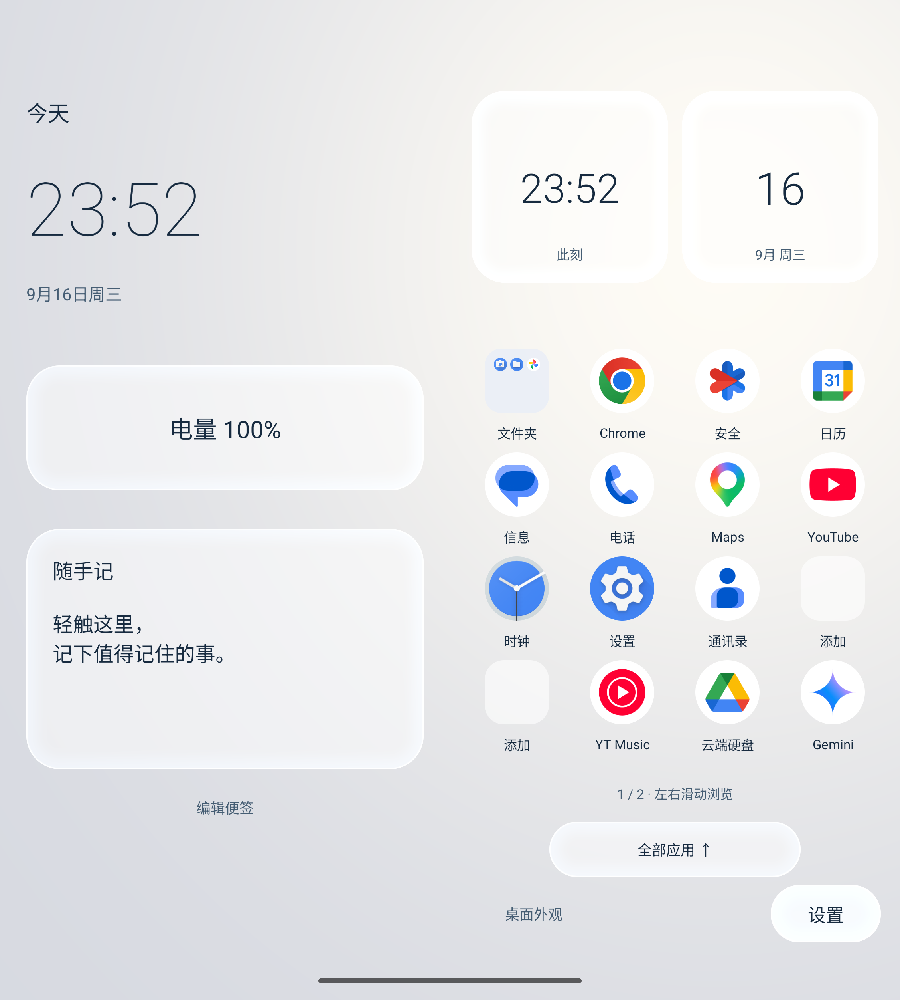
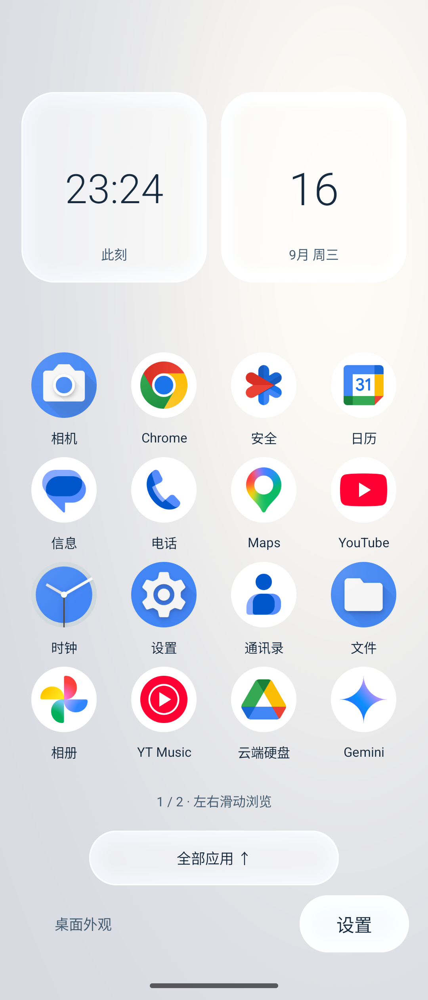
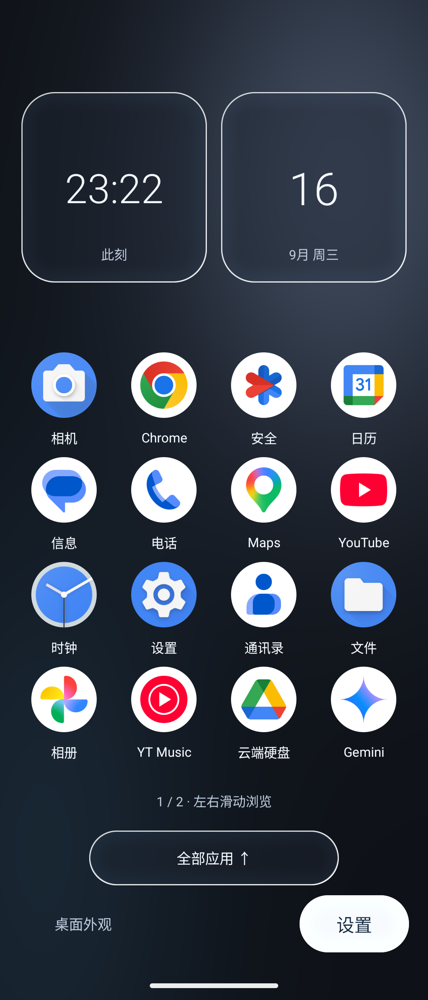
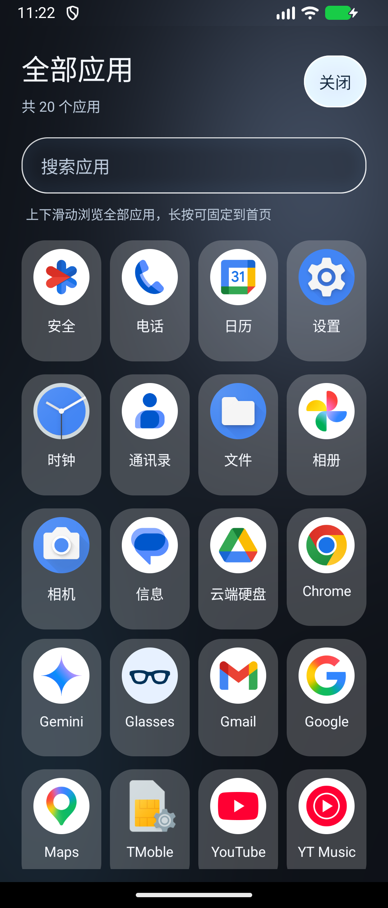
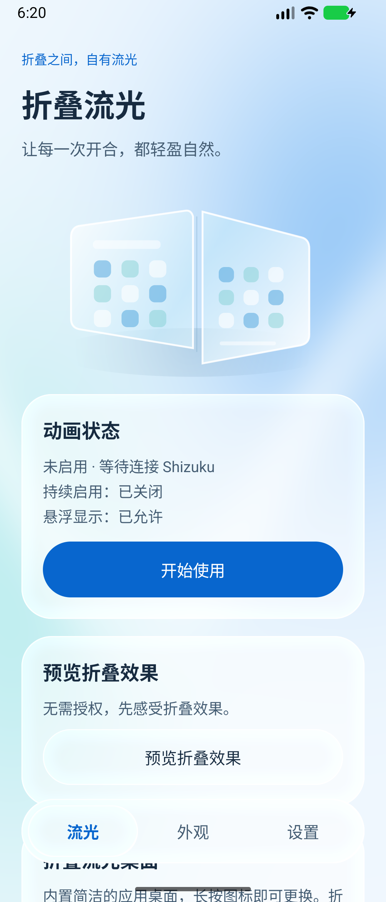
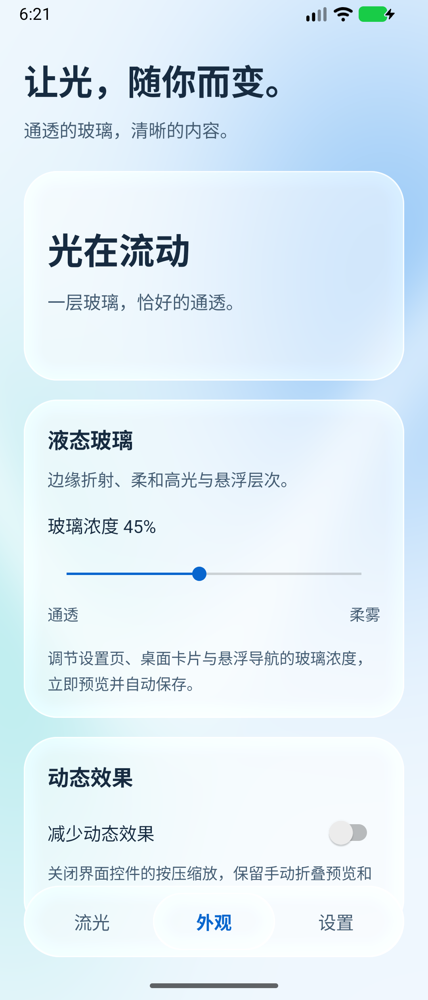

# 折叠流光 · Folduo 中文玻璃版

面向 **三星 Galaxy Z Fold8 Ultra（SM-F9760）／One UI 9.0** 的 Folduo 分支。默认全中文，以 Android 原生界面呈现液态玻璃的通透、高光和悬浮层次。

**0.2.3-zh-glass／code 50 已完成本轮构建、自动化检查和模拟器文件夹检查，并同签名覆盖安装到测试手机；本轮用户开合反馈仍待确认。** 新增桌面应用文件夹，同时补齐连接恢复和更新后回到桌面时恢复已启用动画服务的逻辑。

用户反馈 code 49 已无动画。现场记录了三次 Shizuku `provider is null` 和辅助服务启动超时；打开 Shizuku 管理器后，辅助服务、角度输入与双屏布局恢复。该结果只证明连接恢复，不代表开合视觉验收通过，也不把故障归因于文件夹功能。[0.2.2 历史验证版](https://github.com/iam3301-bot/Folduo/releases/tag/v0.2.2-zh-glass)已公开发布并安装，相关测试结果保留在[验证记录](docs/验证记录.md)。

本次按用户选择“用自带桌面，优先连续动画”：将折叠流光设为默认桌面，保持双屏并行并在内外屏间交接应用；内屏使用轻量手势导航，取消原来的大胶囊导航条。

[0.2.1 历史安装包与 Fold8 配置工具](https://github.com/iam3301-bot/Folduo/releases/tag/v0.2.1-zh-glass)仍可查阅；该 APK 存在三星主屏幕黑壁纸、跨应用不顺和导航条问题，不能当作本次修复版。各候选的构建、测试与用户反馈见[验证记录](docs/验证记录.md)。

[安装与构建说明](docs/安装指南.md) · [验证记录](docs/验证记录.md) · [原项目](https://github.com/bunkaich/Folduo)

## 0.2.3 候选改动

- 桌面应用文件夹：长按首页应用选择“建立文件夹”，选取至少两个应用；点开后从图标网格直接启动，支持重命名、整理成员和解散。也可将后续页或“全部应用”中的应用加入已有文件夹。模拟器已检查创建、内外屏切换、重新打开后保留顺序，以及点击成员启动应用。
- 辅助服务连接恢复：启动超时后清理本应用的旧服务记录，限频唤醒 Shizuku 管理器并重新连接；每次连接独立识别，防止迟到回调覆盖新连接。真机先验证了更新后的直接重连；随后再次覆盖安装触发 provider 不可用及超时，解锁后由本应用自动唤醒管理器并恢复连接，未手工打开管理器。开合画面的用户确认仍待完成。
- 动画服务恢复：回到流光桌面时，若用户已启用动画但服务未运行，会恢复服务；用户主动停止后保持停止。本轮专项测试已覆盖这两种情况。

## 保留的桌面与适配功能

- 桌面首页保留 16 个常用位置，其余已安装的可启动应用自动排列到后续页，每页 16 个，左右滑动翻页；已经固定在首页的应用不在后续页重复出现。
- 从桌面上滑或点击“全部应用”，打开适配内外屏宽度的全屏图标网格。默认直接列出全部应用，可滚动浏览，也可输入名称搜索。
- 长按后续页或“全部应用”中的图标，选择一个首页位置；已经在首页的同一应用换位置时交换原有位置，避免重复。长按首页图标可更换该位置的应用。
- 桌面左下角“桌面外观”提供“月白／石墨／晴空”，默认使用月白。三种外观保留玻璃材质，只改变流光桌面配色，不更改提供角度数据的三星交互壁纸。

- 设置、桌面、预览、通知、恢复提示及错误信息均已中文化。首次启动默认简体中文；仍可手动选择英语或日语。
- 主界面分为“流光／外观／设置”，统一使用玻璃面板和悬浮导航；支持玻璃浓度调节及减少按压动态效果。
- 玻璃材质通过原生 RuntimeShader 实现，对同一程序生成背景进行边缘位移采样和柔化，再叠加可调浓度与高光。不是调用 iOS 的私有组件。
- 新增 SM-F9760 型号入口；启用时继续检查三星并行屏幕状态。独立包名、独立签名，保留原 MIT 许可与第三方声明。
- 兼容独立包名及 One UI 9.0 的壁纸角度日志格式，提供只读设备检查工具。
- 新增 SM-F9760 专用壁纸配置工具：先建立系统备份，再使用手机自带的交互资源；支持恢复原桌面与锁屏，并已完成真机往返检查。
- 修复 One UI 9.0 状态栏初始化时序问题，以及内屏悬浮导航未跟随应用语言的问题。

当前方案继续使用流光默认桌面，在固定的双屏布局中交接前台应用。设置页按“权限与壁纸 → 默认桌面 → 启用”引导，不提供原生三星切屏试验入口。code 49 在完全展开或合上的稳定静置状态下重新订阅角度时，保留当前双屏布局；过渡异常仍通过超时恢复退出，不无限等待。该改动的真机效果尚待验收。当前方案不恢复内屏的三星通知面板或完整原生手势。

## 界面预览

以下为 0.2.3 文件夹的 Android 17 模拟器截图，不能代替三星真机开合验收。

 

  

桌面配色与设置截图保留自已有版本。模拟器分辨率按 SM-F9760 内外屏设置，不能代替三星真实开合测试。

 

## 兼容性范围

| 项目 | 范围 |
| --- | --- |
| 安装系统 | Android 13 起；编译 SDK 37，target SDK 36 |
| 目标机型 | Galaxy Z Fold8 Ultra / SM-F9760 / One UI 9.0 |
| 原项目的已测机型 | Fold7 SM-F966Z / Android 16 / One UI 8.5 |
| 折叠动画依赖 | Shizuku、悬浮显示、三星双屏并行状态，以及持续的精细角度来源 |
| 真机验证情况 | 以[验证记录](docs/验证记录.md)为准，不将模拟器通过当作三星双屏验证 |

当前方案运行时保持双屏并行，会增加耗电；停止动画或锁屏后释放控制。开合过渡使用临时静止画面，画面只保存在内存中，不保存、不上传。流光桌面和效果预览可以在没有 Shizuku 的情况下使用；完整开合方案则使用流光作为默认桌面，并需要辅助权限。

动画仍需要内外屏桌面的三星交互壁纸、Shizuku 与悬浮显示权限，锁屏壁纸可以保留原样。要在合上后继续显示外屏，还需将三星“在外屏上继续使用应用程序”设为“始终”；本次测试手机已完成此设置，APK 不会自动替其他手机修改。

## 构建

准备 JDK 17 或兼容版本与 Android SDK：

```sh
sdkmanager "platforms;android-37.0" "build-tools;36.0.0" "platform-tools"
python3 tools/check-chinese.py
./gradlew :app:assembleDebug :app:testDebugUnitTest :app:lintRelease
```

调试 APK 位于 `app/build/outputs/apk/debug/app-debug.apk`。正式签名与 release 构建方式见[安装指南](docs/安装指南.md#源码与构建)。

## 来源与许可

原项目：[bunkaich/Folduo](https://github.com/bunkaich/Folduo)。原始代码采用 [MIT](LICENSE)，依赖声明见 [THIRD_PARTY_NOTICES.md](THIRD_PARTY_NOTICES.md)。保留[上游英文说明](README.en.md)和[上游日文说明](README.ja.md)以便对照原版行为。

设计参考 [Apple iOS 27](https://www.apple.com/os/ios/) 的 Liquid Glass 材质与可读性。界面素材由代码绘制，不分发苹果或三星的专有图标、壁纸或视频。
